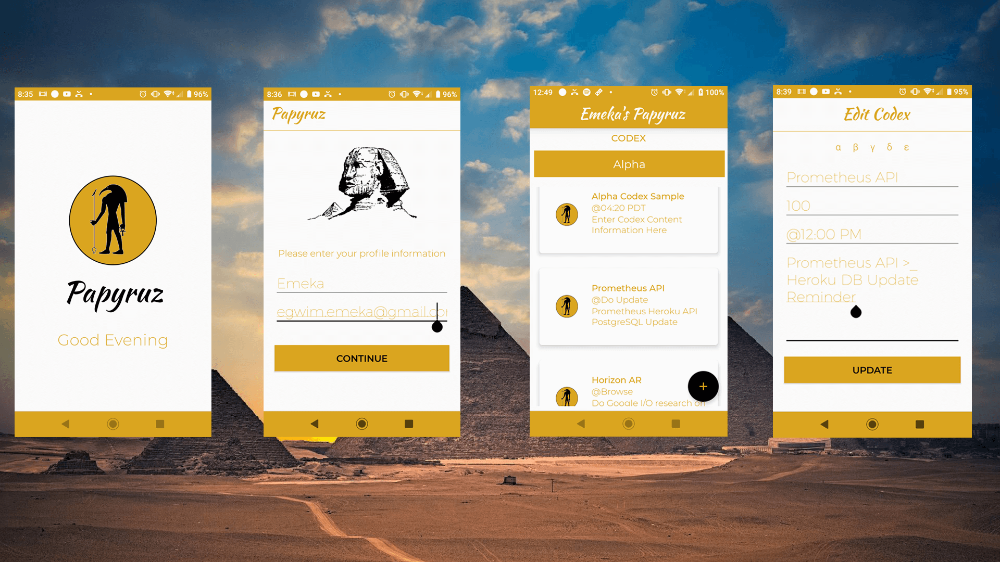

# Papyruz

Papyruz is an austere notepad app for the curation of categorized notes with basic CRUD functionality. The application architecture design is based on the MVVM approach which makes smart use of Observables and Databinding to improve the separation of concerns between respective layers (View, ViewModel, Model, Repository, Database) ; with an emphasis on scalability and speedy testing. 

**Built using:** Adobe Photoshop + Illustrator, Java, SQLite and Android Jetpack - Architecture Components such as LiveData, ViewModel, Room Persistence Library, DataBinding and Material Design. 

### Related Links

**Portfolio URL >_** [https://mekaegwim.ca/portfolio](https://mekaegwim.ca/portfolio)

&nbsp;

